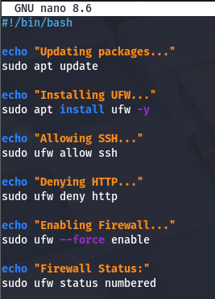
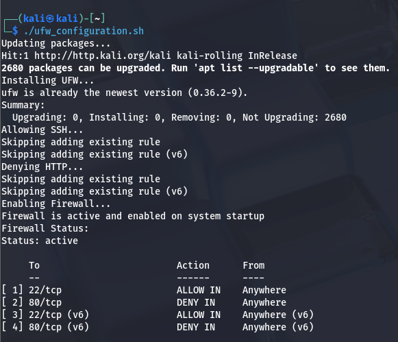

# Basic Firewall Configuration with UFW

## Objective
The objective of this task is to configure a basic firewall using UFW (Uncomplicated Firewall) on a Linux system. Specifically, we will:
- Install and enable UFW firewall
- Configure rules to allow SSH (port 22) for remote administration
- Configure rules to deny HTTP (port 80) traffic
- Verify that all rules are correctly applied and active

This exercise teaches critical security concepts for protecting Linux systems.

---

# Tool Used
- **UFW (Uncomplicated Firewall)** - User-friendly firewall management tool
- **Operating System:** Kali Linux / Ubuntu / Debian-based Linux
- **Network Interface:** eth0 (Ethernet)

---

# Introduction to Firewalls

## What is a Firewall?

A firewall is a security mechanism that monitors and controls incoming and outgoing network traffic based on predefined security rules. Think of it as a security guard at the entrance to your network.

### How Firewalls Work
```
External Traffic → Firewall (Apply Rules) → Internal Network
                   ↓ ALLOW or DENY
```

## UFW (Uncomplicated Firewall)

UFW stands for **Uncomplicated Firewall**. It is a simple and user-friendly command-line tool designed to make firewall configuration accessible to Linux users without extensive networking knowledge.

### Key Features:
- **Simple Syntax** - Easy to understand commands
- **Frontend for iptables** - Abstracts complex iptables rules
- **Default Policy** - Clear default deny/allow policies
- **Port/Service Based** - Can allow/deny by port or service name
- **IPv4 and IPv6** - Supports both protocol versions

Internally, UFW works with **iptables** (older systems) or **nftables** (newer systems) but provides an easier interface for both beginners and administrators.

---

# Why Firewall Configuration is Important

## Security Benefits

Firewall rules are important because they help to:

1. **Prevent Unauthorized Access** 🛡️
   - Block connections from untrusted sources
   - Implement "deny by default, allow by exception" policy
   - Reduce attack surface

2. **Reduce Attack Surface** 📉
   - Only expose services that are necessary
   - Block unnecessary ports and protocols
   - Minimize entry points for attackers

3. **Protect Services Running on the System** 🔐
   - Isolate internal services
   - Control who can access database servers
   - Protect administrative interfaces

4. **Control Which Ports are Reachable** 🚪
   - Whitelist trusted networks
   - Block known malicious IPs
   - Enforce organizational policies

5. **Improve Overall Cybersecurity Posture** 📊
   - Defense in depth strategy
   - Compliance with security standards
   - Incident response capability

## Real-World Impact

**Without a Firewall:**
- All ports could be accessible to anyone
- Services vulnerable to scanning and attacks
- Higher risk of data breaches
- Non-compliance with security standards

**With Proper Firewall Rules:**
- ✅ Only necessary services are exposed
- ✅ Strong perimeter security
- ✅ Better audit trails
- ✅ Compliance with regulations (PCI-DSS, HIPAA, etc.)

---

# Environment Details

| Setting | Value |
|---------|-------|
| **Operating System** | Kali Linux / Ubuntu / Debian |
| **Firewall Tool** | UFW (Uncomplicated Firewall) |
| **Rules to Configure** | Allow SSH (port 22), Deny HTTP (port 80) |
| **IPv4 Support** | Enabled |
| **IPv6 Support** | Enabled |

---

# Complete Step-by-Step Configuration

## Step 1: Update Package List

This ensures we have the latest package information before installation.

### Command
```bash
sudo apt update
```

### Detailed Output
```text
Get:1 http://kali.download/kali kali-rolling InRelease [34.0 kB]
Get:2 http://kali.download/kali kali-rolling/main Sources [72.4 MB]
Hit:3 http://kali.download/kali kali-rolling/contrib Sources
Fetched 74.4 MB in 15s (5,005 kB/s)
Reading package lists... Done
2680 packages can be upgraded.
```

### Explanation of Output

| Output | Meaning | Significance |
|--------|---------|--------------|
| **Get:** | Repository metadata downloaded | Package repository is accessible |
| **Hit:** | Already have latest metadata | No changes needed |
| **Fetched 74.4 MB** | Total data downloaded | Update contains many packages |
| **2680 packages can be upgraded** | Available updates | System is behind on patches |

### Why This Step is Important
- Ensures we're installing the latest version of UFW
- Updates include security patches
- Prevents installing outdated software with known vulnerabilities

---

## Step 2: Install UFW

Now we install the UFW package and its dependencies.

### Command
```bash
sudo apt install ufw -y
```

### Command Breakdown

| Component | Meaning |
|-----------|---------|
| **sudo** | Execute with administrative privileges |
| **apt** | Advanced Package Tool (package manager) |
| **install** | Package management action |
| **ufw** | Package name to install |
| **-y** | Automatically answer "yes" to prompts |

### Detailed Output
```text
Reading package lists... Done
Building dependency tree... Done
Reading state information... Done
The following NEW packages will be installed:
  ufw
0 upgraded, 1 newly installed, 0 removed
Setting up ufw (0.36.2-9) ...
Created symlink /etc/systemd/system/multi-user.target.wants/ufw.service → /etc/systemd/system/ufw.service
Processing triggers for man-db (2.9.4-2) ...
```

### Interpretation of Output

| Message | Meaning |
|---------|---------|
| **Setting up ufw (0.36.2-9)** | UFW version installed |
| **Created symlink** | UFW will start automatically on boot |
| **Processing triggers** | System updating references and documentation |

### Screenshot Reference


---

## Step 3: Allow SSH Traffic (Port 22)

SSH stands for **Secure Shell**. It is the primary method for remote administration of Linux systems. We must allow SSH before enabling the firewall, or we may lose remote access!

### Why This is Critical ⚠️

**Without allowing SSH first:**
- After enabling firewall → SSH port will be blocked
- Cannot connect remotely to the machine
- Physical access required to recover

**Solution:** Always allow SSH before enabling the firewall on remote systems!

### Command
```bash
sudo ufw allow ssh
```

### Detailed Explanation

**Alternative Methods to Achieve the Same Result:**
```bash
sudo ufw allow 22                          # Allow by port number
sudo ufw allow 22/tcp                      # Allow TCP protocol specifically
sudo ufw allow 22/udp                      # Allow UDP protocol specifically
sudo ufw allow in 22                       # Explicitly specify "in" direction
```

### Output
```text
Rules updated
Rules updated (v6)
```

### What This Output Means

| Output | Meaning |
|--------|---------|
| **Rules updated** | IPv4 firewall rules changed |
| **Rules updated (v6)** | IPv6 firewall rules also updated |

UFW automatically updates both IPv4 and IPv6 rules for better compatibility.

### Screenshot References



### SSH Port Details

| Property | Value |
|----------|-------|
| **Port Number** | 22 |
| **Protocol** | TCP (Transmission Control Protocol) |
| **Encryption** | AES-128, AES-256 |
| **Authentication** | Username/password or key-based |
| **Default Timeout** | Server dependent (often 5-10 minutes) |

### Impact of This Rule
- ✅ Remote administration remains functional
- ✅ Secure encrypted connections allowed
- ✅ Port 22/tcp is accessible from any source (can be restricted further)

---

## Step 4: Deny HTTP Traffic (Port 80)

HTTP (Hypertext Transfer Protocol) is the unencrypted web protocol. Denying HTTP traffic prevents:
- Unauthorized web server access
- Unencrypted data transmission
- Reduced attack surface

### Command
```bash
sudo ufw deny http
```

### Command Alternatives
```bash
sudo ufw deny 80                           # Deny by port number
sudo ufw deny 80/tcp                       # Deny TCP specifically
sudo ufw deny in on eth0 to any port 80    # Deny on specific interface
```

### Output
```text
Rules updated
Rules updated (v6)
```

### Explanation of Output
Similar to the SSH rule, both IPv4 and IPv6 are updated.

### Screenshot References


### HTTP vs HTTPS Comparison

| Aspect | HTTP (Port 80) | HTTPS (Port 443) |
|--------|----------------|-----------------|
| **Encryption** | None (Plain text) | SSL/TLS encrypted |
| **Security** | Vulnerable to MITM attacks | Secure |
| **Modern Use** | Deprecated for sensitive data | Recommended for all web traffic |
| **Performance** | Slightly faster | Slightly slower (negligible) |

### Impact of This Rule
- ✅ HTTP traffic is blocked
- ✅ Unencrypted web services cannot communicate
- ✅ Forces use of HTTPS if web services are needed
- ⚠️ May affect legacy applications using HTTP

---

## Step 5: Enable Firewall

Now we activate all the rules we've configured. **This is the point of no return for remote connections!**

### Command
```bash
sudo ufw enable
```

### Output
```text
Command may disrupt existing ssh connections. Proceed with enabling firewall? [y/N]
Firewall is active and enabled on system startup
```

### What This Output Means

| Output | Meaning |
|--------|---------|
| **Command may disrupt** | UFW warns about potential SSH disconnection |
| **Firewall is active** | Rules are now being enforced |
| **Enabled on system startup** | UFW starts automatically after reboot |

### Firewall States

| State | Description | Impact |
|-------|-------------|--------|
| **Enabled** | Firewall is active and enforcing rules | All traffic checked against rules |
| **Disabled** | Firewall is inactive | All traffic allowed (dangerous!) |
| **Reloaded** | Rules have been reapplied | Usually requires brief connectivity interruption |

### Screenshot Reference


### Why This Step is Important
- Activates all configured rules
- Begins protecting the system
- Starts at boot time for persistent security

---

## Step 6: Verify Firewall Status and Rules

Finally, we verify that all rules are correctly applied and active.

### Command
```bash
sudo ufw status numbered
```

### Complete Output Example
```text
Status: active

     To                         Action      From
     --                         ------      ----
[ 1] 22/tcp                     ALLOW       Anywhere
[ 2] 80/tcp                     DENY        Anywhere
[ 3] 22/tcp (v6)                ALLOW       Anywhere (v6)
[ 4] 80/tcp (v6)                DENY        Anywhere (v6)
```

### Detailed Interpretation

| Field | Meaning |
|-------|---------|
| **Status: active** | Firewall is enabled and enforcing rules |
| **To** | Target port/service |
| **Action** | ALLOW, DENY, or REJECT |
| **From** | Source IP (Anywhere = all sources) |
| **Numbered Rules** | Rule priorities (applied top-to-bottom) |

### Rule Breakdown

**Rule 1 & 3: Allow SSH**
- ✅ Port 22/tcp is ALLOWED
- ✅ From ANY source (Anywhere)
- ✅ Both IPv4 and IPv6 supported

**Rule 2 & 4: Deny HTTP**
- ❌ Port 80/tcp is DENIED
- ❌ From ANY source
- ❌ Both IPv4 and IPv6 supported

### Screenshot References


### How to Interpret Rule Order

Rules are processed **top-to-bottom**. The first matching rule is applied:

```
If packet → Port 22 → ALLOW (Rule 1 matches, STOP)
If packet → Port 80 → DENY (Rule 2 matches, STOP)
If packet → Port 443 → ??? (no rule matches, use default policy)
```

---

# Advanced UFW Commands Reference

## Common Operations

### View Current Status
```bash
sudo ufw status                   # Simple status
sudo ufw status numbered          # With rule numbers
sudo ufw status verbose           # Detailed information
```

### Add Rules
```bash
sudo ufw allow 22/tcp             # Allow specific port/protocol
sudo ufw allow from 192.168.1.100 # Allow from specific IP
sudo ufw allow in on eth0 to any port 443  # Allow on specific interface
```

### Remove Rules
```bash
sudo ufw delete allow 22          # Delete rule by service/port
sudo ufw delete 1                 # Delete rule by number (from status)
sudo ufw reset                    # Remove all rules (dangerous!)
```

### Default Policies
```bash
sudo ufw default deny incoming    # Deny all incoming (default)
sudo ufw default allow incoming   # Allow all incoming (dangerous!)
sudo ufw default deny outgoing    # Deny all outgoing
```

### Enable/Disable
```bash
sudo ufw enable                   # Enable firewall
sudo ufw disable                  # Disable firewall
sudo ufw reload                   # Reload rules
```

---

# Port and Service Reference

## Common Network Services

| Service | Port(s) | Protocol | Purpose | Security |
|---------|---------|----------|---------|----------|
| SSH | 22 | TCP | Remote administration | ✅ Encrypted |
| HTTP | 80 | TCP | Web traffic | ❌ Unencrypted |
| HTTPS | 443 | TCP | Secure web traffic | ✅ Encrypted |
| DNS | 53 | TCP/UDP | Domain name resolution | ⚠️ Can be spoofed |
| SMTP | 25 | TCP | Email sending | ❌ May be unencrypted |
| POP3 | 110 | TCP | Email retrieval | ❌ Unencrypted |
| IMAP | 143 | TCP | Email access | ❌ Unencrypted |
| MySQL | 3306 | TCP | Database | ⚠️ If exposed |
| PostgreSQL | 5432 | TCP | Database | ⚠️ If exposed |
| Redis | 6379 | TCP | Cache database | ❌ No auth |
| MongoDB | 27017 | TCP | NoSQL database | ❌ No auth |

---

# Security Best Practices for Firewalls

## 1. Default Deny Policy ✅
- Deny all by default
- Allow only necessary services
- "Least privilege" principle

## 2. Restrict SSH Access ✅
- Change default port (if possible)
- Use key-based authentication
- Restrict SSH to specific IPs

**Example:**
```bash
sudo ufw allow from 192.168.1.0/24 to any port 22
```

## 3. Separate Public and Private Networks ✅
- Internal services on private networks
- Public-facing services on DMZ
- Different firewall rules for each

## 4. Monitor Firewall Logs ✅
- Review blocked connections
- Identify attack patterns
- Respond to threats

**View logs:**
```bash
sudo journalctl -u ufw -n 50
```

## 5. Regularly Audit Rules ✅
- Remove unnecessary rules
- Update rules quarterly
- Document all changes

## 6. Use Explicit Rules ✅
- Avoid ambiguous rules
- Document rule purposes
- Include comment fields

**With comments:**
```bash
sudo ufw allow 22/tcp comment "SSH access"
```

## 7. Plan Before Implementation ✅
- Test in lab first
- Have remote console access
- Document rollback plan

---

# Troubleshooting Guide

## Problem: Cannot Connect via SSH After Enabling Firewall

**Solution:**
1. Use physical console or IPMI/BMC access
2. Check SSH is allowed:
   ```bash
   sudo ufw status
   ```
3. Re-enable SSH if needed:
   ```bash
   sudo ufw allow ssh
   sudo ufw reload
   ```

## Problem: Application Cannot Access Network

**Solution:**
1. Identify the port used by application
2. Check firewall rules:
   ```bash
   sudo ufw status
   ```
3. Add allow rule:
   ```bash
   sudo ufw allow <port>
   ```

## Problem: Performance Degradation

**Solution:**
- UFW has minimal performance impact
- Check for excessive logging
- Reduce number of rules if possible

## Problem: Firewall Won't Enable

**Solution:**
1. Check if already enabled:
   ```bash
   sudo ufw status
   ```
2. Reset and reconfigure:
   ```bash
   sudo ufw reset
   ```
3. Verify UFW installed:
   ```bash
   which ufw
   ```

---

# Files Included in This Task

- **ufw_configuration.sh** - Bash script with all configuration commands
- **README.md** - This comprehensive guide
- **Screenshots/** - Visual documentation
  - `ufw_configuration.png` - Initial configuration
  - `ufw_configuration_output.png` - Full output examples
  - `sudo ufw allow ssh.png` - SSH rule creation
  - `sudo ufw deny http.png` - HTTP denial rule
  - `sudo ufw enable.png` - Firewall activation
  - `sudo ufw status numbered.png` - Final rule verification

---

# Lab Exercises

## Exercise 1: Add HTTPS Support
```bash
sudo ufw allow https
sudo ufw status
```

## Exercise 2: Allow from Specific IP
```bash
sudo ufw allow from 192.168.88.100 to any port 3306
sudo ufw status
```

## Exercise 3: Delete a Rule
```bash
sudo ufw delete allow 80
sudo ufw status
```

## Exercise 4: Check UFW Logs
```bash
sudo journalctl -u ufw -n 20
```

---

# Conclusion

This task demonstrated how to:
- ✅ Install UFW firewall on a Linux system
- ✅ Configure rules to allow SSH (necessary for remote management)
- ✅ Configure rules to deny HTTP (unnecessary service)
- ✅ Enable firewall and verify rules are active

A properly configured firewall is one of the **most important security controls** for any Linux system. The "Default Deny, Allow by Exception" policy implemented here represents security best practices that protect systems from unauthorized access while maintaining necessary administrative access.

**Key Takeaway:** Always test firewall changes on non-critical systems first, and always ensure you have a means to access the system (physical console, IPMI, etc.) in case you accidentally lock yourself out!

     To                         Action      From
     --                         ------      ----
[ 1] 22/tcp                     ALLOW IN    Anywhere
[ 2] 80/tcp                     DENY IN     Anywhere
[ 3] 22/tcp (v6)                ALLOW IN    Anywhere (v6)
[ 4] 80/tcp (v6)                DENY IN     Anywhere (v6)
```

---

# Detailed Explanation of Output

## Status: active
The firewall is currently running and protecting the system.

## Column Meaning

### To
Destination port or service.

### Action
What happens to traffic:
- **ALLOW** = Permit connection
- **DENY** = Block connection

### From
Source of incoming traffic.

**Anywhere** means any IP address can attempt access.

---

# Rule-by-Rule Explanation

## Rule [1]
`22/tcp ALLOW IN Anywhere`

Allows IPv4 SSH traffic on port 22.

## Rule [2]
`80/tcp DENY IN Anywhere`

Blocks IPv4 HTTP traffic on port 80.

## Rule [3]
`22/tcp (v6) ALLOW IN Anywhere (v6)`

Allows IPv6 SSH traffic.

## Rule [4]
`80/tcp (v6) DENY IN Anywhere (v6)`

Blocks IPv6 HTTP traffic.

---

# Networking Concepts

## What is a Port?

A port is a communication endpoint used by applications.

Examples:
- Port 22 → SSH
- Port 80 → HTTP
- Port 443 → HTTPS

---

## What is TCP?

TCP (Transmission Control Protocol) is a reliable communication protocol used by many network services.

Examples:
- SSH uses TCP
- HTTP uses TCP
- HTTPS uses TCP

---

## Why Separate IPv4 and IPv6 Rules?

Modern systems support both:
- IPv4
- IPv6

UFW creates rules for both versions to ensure complete protection.

---

# Security Significance

## SSH Allowed

Good because:
- Required for system administration
- Secure encrypted access
- Standard management protocol

Best Practices:
- Use SSH keys
- Disable root login
- Use strong passwords

---

## HTTP Denied

Good because:
- Stops unnecessary website access
- Prevents accidental exposure
- Reduces web attack risks

---

# Automation Script

The file `ufw_configuration.sh` automates the complete setup:

1. Update packages  
2. Install UFW  
3. Allow SSH  
4. Deny HTTP  
5. Enable firewall  
6. Show firewall status  

## Run Script

```bash
chmod +x ufw_configuration.sh
./ufw_configuration.sh
```

---

# Files Included

- `ufw_configuration.sh`
- `README.md`
- Screenshot of `ufw status numbered`

---

# Conclusion

This task successfully demonstrated how to configure a Linux firewall using UFW. SSH traffic was allowed, HTTP traffic was denied, and the firewall was enabled with verified rules. UFW is a simple yet powerful tool for securing Linux systems and controlling network access.