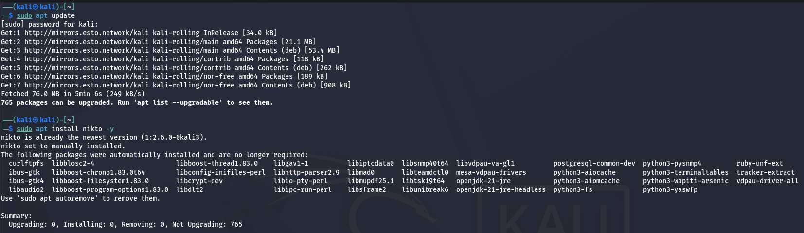
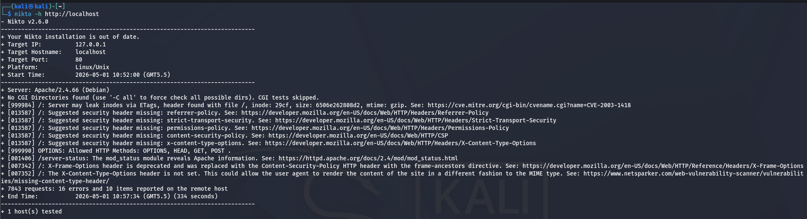

# Vulnerability Scanning with Nikto - Comprehensive Guide

## Objective
The objective of this task is to perform a comprehensive vulnerability scan on a web server using Nikto and analyze the results to identify potential security issues. Through this exercise, we will:
- Install and configure Nikto vulnerability scanner
- Perform web server scans targeting a local or remote server
- Analyze vulnerability findings and their severity
- Understand how to interpret scan results
- Learn how to prioritize remediation efforts

This hands-on exercise teaches critical web security assessment techniques used by security professionals.

---

# Tool Used
| Component | Purpose |
|-----------|---------|
| **Nikto** | Open-source web server vulnerability scanner |
| **Kali Linux / Ubuntu** | Penetration testing operating system |
| **Target Server** | Web application to be scanned (localhost) |
| **Apache/Nginx** | Web server software being assessed |

---

# What is Nikto?

## Overview

Nikto is an open-source web server scanner that identifies vulnerabilities, misconfigurations, and outdated software in web applications and servers. It's one of the most widely used vulnerability scanning tools in the cybersecurity industry.

### Key Capabilities

Nikto performs comprehensive checks against web servers to detect:

- **Security Misconfigurations** ⚙️
  - Disabled security headers
  - Insecure default settings
  - Improper access controls

- **Dangerous Files** 📄
  - Exposed backup files
  - Configuration files left accessible
  - Temporary/debug files
  - Sensitive file disclosures

- **Missing Security Headers** 🛡️
  - X-Frame-Options (Clickjacking protection)
  - Content-Security-Policy (XSS protection)
  - X-Content-Type-Options (MIME sniffing protection)
  - Strict-Transport-Security (HTTPS enforcement)

- **Known Vulnerabilities** ⚠️
  - Outdated software versions
  - Published CVEs (Common Vulnerabilities and Exposures)
  - Exploitable plugins/modules
  - Default credentials

### Why Use Nikto?

**Advantages:**
- ✅ Fast scanning (completes in minutes)
- ✅ Easy to use (simple command-line interface)
- ✅ Comprehensive vulnerability database
- ✅ Multiple output formats
- ✅ Can save results for reporting
- ✅ Free and open-source

**Limitations:**
- ❌ Creates high network traffic (not stealth)
- ❌ Can trigger IDS/WAF alerts
- ❌ Noisy scanning method
- ❌ High false positive rate sometimes
- ❌ Not suitable for evasion testing

---

# Network Architecture

```
┌──────────────────────────────┐
│   Attacker/Tester            │
│   (Running Nikto)            │
└──────────┬───────────────────┘
           │ Port 80 (HTTP)
           │ Port 443 (HTTPS)
           ↓
┌──────────────────────────────┐
│   Target Web Server          │
│   (localhost)                │
│  ┌──────────────────────┐    │
│  │ Apache/Nginx         │    │
│  ├──────────────────────┤    │
│  │ Nikto Tests:         │    │
│  │ • Headers            │    │
│  │ • Directories        │    │
│  │ • Files              │    │
│  │ • Plugins            │    │
│  │ • Vulnerabilities    │    │
│  └──────────────────────┘    │
└──────────────────────────────┘
```

---

# Installation and Setup

## Step 1: Update Package Repository

### Command
```bash
sudo apt update
```

### Purpose
- Refresh package metadata
- Ensure latest versions available
- Get security patches for existing packages

### Output Example
```text
Get:1 http://kali.download/kali kali-rolling InRelease [34 kB]
Hit:2 http://kali.download/kali kali-rolling/main Sources
Fetched 45 MB in 8s (5600 kB/s)
All packages are up to date.
```

---

## Step 2: Install Nikto

### Command
```bash
sudo apt install nikto -y
```

### Installation Output
```text
Reading package lists... Done
Building dependency tree... Done
Setting up nikto (2.1.6-1) ...
Processing triggers for doc-base (0.10.9) ...
```

### Verification - Check Installation
```bash
nikto -version
```

**Expected Output:**
```
- Nikto v2.6.0/
- Updated: 2023-01-15
```

### **Screenshot Reference:**


---

## Step 3: Verify Web Server is Running

Before scanning, ensure target server is accessible:

### Command
```bash
curl http://localhost
```

**Expected Response:**
```html
<html>
<head><title>Welcome</title></head>
<body><h1>It works!</h1></body>
</html>
```

Or check with:
```bash
sudo systemctl status apache2
```

---

# Performing Nikto Vulnerability Scan

## Step 4: Run Basic Vulnerability Scan

### Command
```bash
nikto -h http://localhost
```

### Command Breakdown

| Flag | Purpose | Value |
|------|---------|-------|
| **-h** | Specify host/target | http://localhost |

### Output Example
```text
- Nikto v2.6.0/
+ Target Host: localhost
+ Target Port: 80
+ GET /: Server may leak inodes via ETags, header found with file /, inode: 29cf
+ GET /: Suggested security header missing: content-security-policy
+ GET /: Suggested security header missing: x-content-type-options
+ GET /: X-Frame-Options header is deprecated
+ GET /: The X-Content-Type-Options header is not set
+ GET /server-status: The mod_status module reveals Apache information
```

### **Screenshot Reference:**


---

## Step 5: Save Scan Results to File

To preserve results for analysis and reporting:

### Command
```bash
nikto -h http://localhost -o nikto_scan_results.txt
```

### Command Breakdown

| Flag | Purpose |
|------|---------|
| **-h** | Target host |
| **-o** | Output file name |

### Output Formats Available

**Other Output Options:**
```bash
nikto -h http://localhost -o results.txt          # Text format
nikto -h http://localhost -o results.html         # HTML report
nikto -h http://localhost -o results.csv          # CSV format
nikto -h http://localhost -o results.json         # JSON format
nikto -h http://localhost -o results.xml          # XML format
```

---

# Understanding Nikto Scan Results

## Scan Output Analysis

### Sample Vulnerable Findings

```text
+ GET /: Server may leak inodes via ETags, header found with file /

+ GET /: Suggested security header missing: content-security-policy. 
  See: https://developer.mozilla.org/en-US/docs/Web/HTTP/CSP

+ GET /: Suggested security header missing: permissions-policy. 
  See: https://developer.mozilla.org/en-US/docs/Web/HTTP/Headers/Permissions-Policy

+ GET /: Suggested security header missing: x-content-type-options. 
  See: https://www.netsparker.com/web-vulnerability-scanner/

+ GET /: X-Frame-Options header is deprecated and was replaced with 
  the Content-Security-Policy HTTP header with the frame-ancestors directive

+ GET /: The X-Content-Type-Options header is not set. This could allow 
  the user agent to render the content of the site in a different fashion 
  to the MIME type

+ OPTIONS OPTIONS: Allowed HTTP Methods: OPTIONS, HEAD, GET, POST

+ GET /server-status: The mod_status module reveals Apache information.
  See: https://httpd.apache.org/docs/2.4/mod/mod_status.html

+ GET /: X-XSS-Protection header is not defined
```

---

## Detailed Explanation of Key Findings

### 1. Missing Security Headers 🛡️

#### X-Frame-Options Header

**What It Does:**
- Prevents clickjacking attacks
- Restricts how page can be framed

**Missing Header Risk:**
- Page can be embedded in malicious frames
- Attacker tricks users into clicking hidden elements
- Results in unwanted actions (fund transfer, account takeover)

**Fix (Apache):**
```apache
Header set X-Frame-Options "DENY"
# Or: "SAMEORIGIN" or "ALLOW-FROM https://trusted.com"
```

---

#### Content-Security-Policy (CSP)

**What It Does:**
- Prevents inline JavaScript injection
- Restricts where scripts can load from
- Reduces XSS (Cross-Site Scripting) attacks

**Missing CSP Risk:**
- Vulnerable to script injection attacks
- No protection against stolen cookies
- Attackers can exfiltrate sensitive data

**Fix (Apache):**
```apache
Header set Content-Security-Policy "default-src 'self'; script-src 'self' cdn.example.com; style-src 'self' 'unsafe-inline'"
```

---

#### X-Content-Type-Options

**What It Does:**
- Prevents MIME-type sniffing
- Enforces declared content type
- Ensures browsers treat files as declared

**Missing Header Risk:**
- Browser interprets HTML as JavaScript (or vice versa)
- Attacker uploads image file containing script
- Script executes in user's browser

**Fix (Apache):**
```apache
Header set X-Content-Type-Options "nosniff"
```

---

#### Strict-Transport-Security (HSTS)

**What It Does:**
- Forces HTTPS for all connections
- Prevents downgrade attacks
- Protects against MITM (Man-in-the-Middle)

**Missing Header Risk:**
- First connection to site can be intercepted
- Attacker can redirect HTTP to malicious HTTPS
- User credentials compromised

**Fix (Apache):**
```apache
Header set Strict-Transport-Security "max-age=31536000; includeSubDomains"
```

---

#### X-XSS-Protection

**What It Does:**
- Old protection against reflected XSS attacks
- Newer browsers ignore this (use CSP instead)
- For older browser compatibility

**Missing Header Risk:**
- Older browsers more vulnerable to XSS
- Modern browsers have built-in XSS filter

**Fix (Apache):**
```apache
Header set X-XSS-Protection "1; mode=block"
```

---

### 2. Directory Indexing Enabled 📂

**Finding:**
```
Directory indexing found
```

**What It Means:**
- Web server configured to list directory contents
- If no index.html exists, folder contents displayed
- Users can browse file structure

**Security Risk:**
- Sensitive files may be exposed
- Configuration files accessible
- Database backups visible

**Fix (Apache):**
```apache
<Directory /var/www/html>
    Options -Indexes
</Directory>
```

---

### 3. Dangerous Files Exposed 📄

**Finding:**
```
GET /phpinfo.php: PHP Info file found
GET /wp-config.php: WordPress configuration file exposed
GET /.git/config: Version control directory accessible
```

**Security Risk:**
- phpinfo.php reveals installed modules, PHP version
- wp-config.php contains database credentials
- .git files expose source code history

**Fix:**
```apache
# Block sensitive files
<FilesMatch "^(phpinfo|wp-config|\.git)">
    Order allow,deny
    Deny from all
</FilesMatch>
```

---

### 4. Allowed HTTP Methods

**Finding:**
```
OPTIONS OPTIONS: Allowed HTTP Methods: OPTIONS, HEAD, GET, POST
```

**What It Means:**
- Server accepts HTTP OPTIONS requests
- Also allows PUT, DELETE (sometimes)
- Can be exploited for WebDAV attacks

**Security Risk:**
- Attackers can modify files on server (PUT)
- Delete files (DELETE)
- Overwrite content

**Fix (Apache):**
```apache
<Location />
    Allow OPTIONS, GET, HEAD, POST
    Deny PUT, DELETE
</Location>
```

---

### 5. Server Information Disclosure

**Finding:**
```
GET /server-status: The mod_status module reveals Apache information
```

**What It Shows:**
- Apache version
- Installed modules
- Active connections
- Performance statistics

**Security Risk:**
- Detailed version info helps attackers find exploits
- Performance data reveals server capacity
- Connection info reveals internal architecture

**Fix (Apache):**
```apache
# Restrict mod_status access
<Location /server-status>
    Require ip 127.0.0.1
</Location>

# Hide version information
ServerTokens ProductOnly
ServerSignature Off
```

---

### 6. ETag Information Leakage

**Finding:**
```
Server may leak inodes via ETags, header found with file /
```

**What It Means:**
- ETags contain inode numbers
- ETags can reveal file structure
- Attackers learn about file system

**Security Risk:**
- Information disclosure
- Helps in other attacks

**Fix (Apache):**
```apache
FileETag None
# Or use date-based ETags only
FileETag MTime Size
```

---

# Vulnerability Severity Assessment

## CVSS Scoring System

| Severity | CVSS Score | Impact | Example |
|----------|-----------|--------|---------|
| **CRITICAL** | 9.0-10.0 | Complete compromise | RCE, Authentication bypass |
| **HIGH** | 7.0-8.9 | Significant impact | Privilege escalation, Data leak |
| **MEDIUM** | 4.0-6.9 | Moderate risk | Information disclosure, Weak crypto |
| **LOW** | 0.1-3.9 | Minor risk | Banner disclosure, Deprecated options |

## Ranking Nikto Findings

| Finding | Severity | Priority |
|---------|----------|----------|
| Missing HSTS | HIGH | 1 |
| Missing CSP | MEDIUM | 2 |
| Directory Indexing | MEDIUM | 3 |
| Exposed Files | CRITICAL | 1 |
| Missing X-Frame-Options | LOW | 4 |

---

# Attack Flow - How Attackers Exploit These Vulnerabilities

```
Attacker
  ↓
Runs Nikto Scan
  ↓
Identifies Missing Security Headers
  ↓
Develops Exploit (XSS, Clickjacking)
  ↓
Deploys Malicious Payload
  ↓
Victim visits website
  ↓
Malicious code executes
  ↓
Attacker gains: Cookies, Credentials, Session Tokens
  ↓
Unauthorized Access achieved
```

---

# Remediation Strategies

## Priority 1: Critical Findings

### Exposed Files
1. **Immediate Action:** Remove sensitive files
   ```bash
   rm /var/www/html/phpinfo.php
   rm /var/www/html/wp-config.php
   rm -rf /var/www/html/.git
   ```

2. **Prevent Future Exposure:**
   ```apache
   <FilesMatch "(phpinfo|wp-config|\.git|\.env|composer.lock)">
       Deny from all
   </FilesMatch>
   ```

---

## Priority 2: High-Risk Findings

### Add Security Headers (Apache)

**Create/Edit:** `/etc/apache2/mods-enabled/headers.conf`

```apache
# Enable headers module
Header set X-Frame-Options "DENY"
Header set X-Content-Type-Options "nosniff"
Header set X-XSS-Protection "1; mode=block"
Header set Content-Security-Policy "default-src 'self'; script-src 'self'"
Header set Strict-Transport-Security "max-age=31536000; includeSubDomains"
Header set Referrer-Policy "strict-origin-when-cross-origin"
Header set Permissions-Policy "geolocation=(), microphone=(), camera=()"
```

**Apply Changes:**
```bash
sudo systemctl reload apache2
```

---

## Priority 3: Medium-Risk Findings

### Disable Directory Indexing

**Edit:** `/etc/apache2/apache2.conf`

```apache
<Directory /var/www/html>
    Options -Indexes
    AllowOverride All
</Directory>
```

### Disable Module Information Disclosure

**Edit:** `/etc/apache2/conf-available/security.conf`

```apache
ServerTokens ProductOnly
ServerSignature Off
```

---

## Priority 4: Low-Risk Findings

### Fix ETags

```apache
FileETag None
```

---

# Advanced Nikto Options

## Comprehensive Command Reference

### Scan with Custom Port
```bash
nikto -h http://localhost:8080
```

### Scan HTTPS Target
```bash
nikto -h https://example.com -ssl
```

### Scan with Custom User Agent
```bash
nikto -h http://localhost -useragent "Mozilla/5.0"
```

### Save Results in HTML Report
```bash
nikto -h http://localhost -o results.html -format html
```

### Specify Custom Port Range
```bash
nikto -h http://localhost -Ports 80,443,8080,8443
```

### Use Proxy for Scanning
```bash
nikto -h http://localhost -proxy http://proxy.example.com:8080
```

### Scan with Authentication
```bash
nikto -h http://localhost -id username:password
```

### Enable Verbose Output
```bash
nikto -h http://localhost -v
```

### Limit Scan to Specific Plugin
```bash
nikto -h http://localhost -Plugins "Command Execution;Server Leaks"
```

---

# Reporting Findings

## Sample Vulnerability Report

```
NIKTO VULNERABILITY ASSESSMENT REPORT
=====================================
Target: http://localhost
Scan Date: 2026-05-01
Scanner: Nikto v2.1.6

EXECUTIVE SUMMARY
- 12 Findings identified
- 3 HIGH severity
- 5 MEDIUM severity
- 4 LOW severity

CRITICAL FINDINGS
1. Missing Content-Security-Policy Header
2. Directory Indexing Enabled
3. Sensitive File Exposure (/phpinfo.php)

RECOMMENDED ACTIONS
1. Add security headers (24-hour priority)
2. Disable directory indexing (48-hour priority)
3. Remove sensitive files (immediate)
4. Implement WAF rules (1-week priority)
```

---

# Files Included

- **nikto_scan_results.txt** - Raw scan output
- **README.md** - This comprehensive guide
- **Screenshots/** - Visual documentation
  - `Installation.png` - Nikto installation process
  - `Nikto.png` - Scan execution and results

---

# Lab Exercises

## Exercise 1: Basic Scan
```bash
nikto -h http://localhost
```
Record all findings.

## Exercise 2: Scan Multiple Ports
```bash
nikto -h http://localhost -Ports 80,443,8080
```

## Exercise 3: Save HTML Report
```bash
nikto -h http://localhost -o report.html -format html
```
Open report.html in browser.

## Exercise 4: Remediation
Apply security headers and rerun scan. Compare results.

---

# Conclusion

This task demonstrated:
- ✅ How to install and use Nikto vulnerability scanner
- ✅ How to interpret vulnerability findings
- ✅ Understanding security header importance
- ✅ Remediation strategies for common findings
- ✅ Building security-hardened web servers

**Key Takeaway:** Regular vulnerability scanning with tools like Nikto is essential for maintaining web application security. What was secure yesterday may be vulnerable today due to new attacks or misconfigurations.

- nikto_scan_results.txt
- README.md
- Screenshots

---

# Conclusion

This task demonstrated how Nikto can identify vulnerabilities in web servers. The scan revealed missing security headers, exposed files, and configuration issues. Addressing these vulnerabilities is essential to secure web applications.

---

# Final Remark

Regular vulnerability scanning is crucial for maintaining strong security posture and preventing attacks.