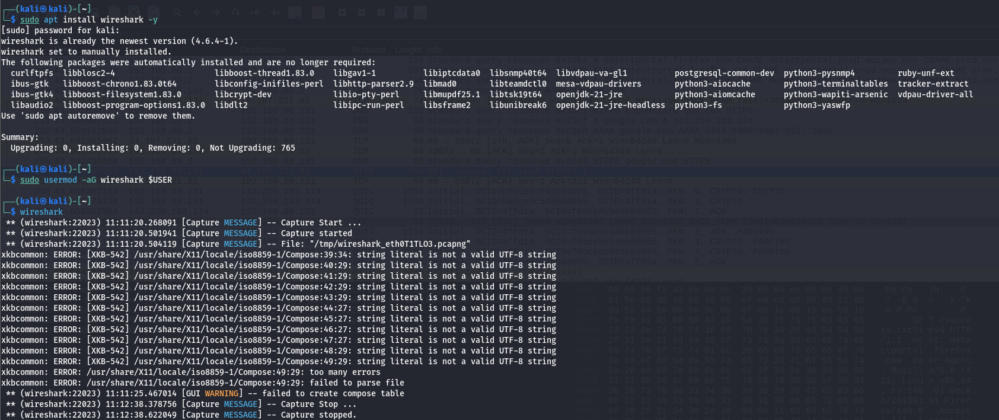

# Network Traffic Capture and Analysis using Wireshark - Complete Guide

## Objective
The objective of this task is to capture and analyze network traffic using Wireshark, understand how data travels across networks, and learn to interpret network packets. Through this exercise, we will:
- Install and configure Wireshark
- Capture live network traffic
- Filter and analyze specific protocols (HTTP, TCP, UDP, DNS)
- Understand packet structure and headers
- Perform network troubleshooting and security analysis

This hands-on exercise teaches fundamental network analysis skills essential for cybersecurity professionals, network administrators, and developers.

---

# Tool Used
| Component | Purpose |
|-----------|---------|
| **Wireshark** | Network protocol analyzer - captures and displays network packets |
| **Kali Linux / Ubuntu** | Penetration testing operating system |
| **Network Interface** | eth0, wlan0 - Physical connection to network |
| **Protocols** | HTTP, TCP, UDP, DNS, ICMP, ARP |

---

# What is Wireshark?

## Overview

Wireshark is the world's leading open-source network protocol analyzer. It allows you to capture and interactively browse packets traveling through your network in real-time.

### Key Features

- **Real-time Packet Capture** 🎬
  - Capture packets as they traverse network
  - Monitor all network activity
  - Support for 1000+ protocols

- **Powerful Filtering** 🔍
  - Display filters for specific traffic
  - Capture filters to reduce noise
  - Save complex filters

- **Deep Packet Inspection** 🔬
  - View packet headers and payloads
  - Analyze protocol-specific details
  - Understand communication flow

- **Color Coding** 🎨
  - Visual identification of packet types
  - Quick error detection
  - Traffic flow visualization

- **Export Capabilities** 💾
  - Save captured data in various formats
  - Generate reports
  - Export for forensic analysis

### Common Use Cases

**Network Troubleshooting:**
- Diagnose connectivity issues
- Identify packet loss
- Analyze latency problems
- Debug network applications

**Security Analysis:**
- Detect network-based attacks
- Analyze malware communication
- Identify suspicious traffic patterns
- Perform forensic investigations

**Protocol Development:**
- Debug protocol implementations
- Verify protocol compliance
- Test new protocol designs

**Performance Optimization:**
- Identify bandwidth hogs
- Analyze protocol overhead
- Optimize network utilization

---

# Understanding Network Packets

## Packet Structure (OSI Model)

```
┌─────────────────────────────────────────────────────────┐
│ Application Layer (Layer 7)                             │
│ HTTP Headers, DNS Queries, SMTP Data                    │
├─────────────────────────────────────────────────────────┤
│ Transport Layer (Layer 4)                               │
│ TCP/UDP Headers (Port Numbers)                          │
├─────────────────────────────────────────────────────────┤
│ Network Layer (Layer 3)                                 │
│ IP Headers (Source/Destination IP)                      │
├─────────────────────────────────────────────────────────┤
│ Data Link Layer (Layer 2)                               │
│ Ethernet Headers (MAC Addresses)                        │
├─────────────────────────────────────────────────────────┤
│ Physical Layer (Layer 1)                                │
│ Electrical Signals, Fiber Optics                        │
└─────────────────────────────────────────────────────────┘
```

## Typical HTTP Request Packet

```
ETHERNET FRAME:
├─ Destination MAC: 00:11:22:33:44:55
├─ Source MAC: AA:BB:CC:DD:EE:FF
└─ Type: IP (0x0800)

IPv4 HEADER:
├─ Source IP: 192.168.1.100
├─ Destination IP: 93.184.216.34 (example.com)
├─ Protocol: TCP (6)
└─ TTL: 64

TCP SEGMENT:
├─ Source Port: 54321
├─ Destination Port: 80 (HTTP)
├─ Sequence Number: 1234567890
├─ Acknowledgment Number: 0
├─ Flags: SYN
└─ Window Size: 65535

HTTP REQUEST:
├─ Method: GET
├─ Resource: /index.html
├─ Host: example.com
├─ User-Agent: Mozilla/5.0
└─ Connection: keep-alive
```

---

# Installation and Setup

## Step 1: Update System Packages

### Command
```bash
sudo apt update
```

### Purpose
- Refresh package repository information
- Ensure latest versions available
- Get security updates

### Output
```text
Get:1 http://kali.download/kali kali-rolling InRelease [34 kB]
Fetched 45 MB in 8s
Reading package lists... Done
All packages are up to date.
```

---

## Step 2: Install Wireshark

### Command
```bash
sudo apt install wireshark -y
```

### Installation Components

| Package | Purpose |
|---------|---------|
| **wireshark** | GUI application |
| **wireshark-common** | Common libraries |
| **libwireshark-dev** | Development files |
| **tshark** | Command-line packet capture tool |

### Installation Output
```text
Setting up wireshark (3.6.5-1) ...
Processing triggers for desktop-database (0.25-2) ...
Processing triggers for mime-types (0.112-1) ...
```

### **Screenshot Reference:**


---

## Step 3: Configure Wireshark Permissions

By default, capturing packets requires root privileges. To capture without sudo, add your user to the wireshark group:

### Commands
```bash
sudo usermod -a -G wireshark $USER
sudo chmod +x /usr/bin/dumpcap
```

### Verification
```bash
groups $USER
# Should show: user adm wireshark sudo
```

---

# Wireshark GUI Overview

## Starting Wireshark

### Command
```bash
wireshark
```

### GUI Layout

```
┌────────────────────────────────────────────────────────┐
│ File Edit View Go Capture Tools Help                   │
├────────────────────────────────────────────────────────┤
│ [Interface List]  Refresh  Options  Details  Statistics│
├────────────────────────────────────────────────────────┤
│                                                         │
│  Available Network Interfaces:                          │
│  ☐ eth0 (192.168.1.100)                               │
│  ☐ wlan0                                               │
│  ☐ lo (127.0.0.1) - Loopback                          │
│                                                         │
└────────────────────────────────────────────────────────┘
```

---

# Capturing Network Traffic

## Step 4: Select Network Interface

### Procedure

1. Start Wireshark: `wireshark`
2. From the interface list, select your network adapter:
   - **eth0** - Wired Ethernet connection
   - **wlan0** - WiFi connection
   - **lo** - Loopback (local traffic only)

### Network Interface Details

| Interface | Type | Use Case |
|-----------|------|----------|
| **eth0** | Wired | Most stable, best for lab work |
| **wlan0** | WiFi | Mobile environments, range limitations |
| **lo** | Loopback | Test applications, local traffic only |
| **docker0** | Virtual | Container networking |
| **virbr0** | Virtual | Virtual machine networking |

---

## Step 5: Start Packet Capture

### Procedure
1. Double-click the interface to begin capturing
2. Wireshark starts collecting all packets on that interface
3. Packet list updates in real-time

### Capture Window

```
┌──────────────────────────────────────────────────────────┐
│ Packet List (Top Panel)                                  │
│ No.  Time  Source IP      Dest IP       Protocol  Length │
│ 1    0.0   192.168.1.100  8.8.8.8       DNS       62    │
│ 2    0.1   192.168.1.100  172.217.0.1   HTTP      1418  │
│ 3    0.2   172.217.0.1    192.168.1.100 TCP       60    │
├──────────────────────────────────────────────────────────┤
│ Packet Details (Middle Panel)                            │
│ ▼ Frame 2: 1418 bytes on wire (11344 bits/s)           │
│   ▼ Ethernet II, Src: AA:BB:CC:DD:EE:FF                 │
│     ▼ Internet Protocol Version 4                        │
│       ▼ Transmission Control Protocol                    │
│         ▼ HyperText Transfer Protocol                    │
├──────────────────────────────────────────────────────────┤
│ Packet Bytes (Bottom Panel - Hex dump)                   │
│ 0000   00 11 22 33 44 55 aa bb cc dd ee ff 08 00 45 00  │
│ 0010   05 8e ...                                         │
└──────────────────────────────────────────────────────────┘
```

---

## Step 6: Generate Network Traffic

Open a browser and visit websites to generate traffic:

### Commands / Actions

**In Terminal:**
```bash
# DNS query
nslookup google.com

# HTTP request
curl http://example.com

# Ping (ICMP)
ping 8.8.8.8
```

**In Browser:**
1. Open Firefox or Chrome
2. Navigate to: `http://example.com`
3. Wait for page to load
4. Observe packets in Wireshark capture

### Expected Traffic

```
DNS: Query for example.com
↓
HTTP: TCP connection establish (3-way handshake)
↓
HTTP: GET request for index.html
↓
HTTP: Response with HTML content
↓
HTTP: Connection close
```

---

# Analyzing Captured Traffic

## Step 7: Apply Display Filters

Filters help isolate specific traffic types from the entire capture.

### Filter Syntax Examples

#### Protocol Filters
```
http          # All HTTP traffic
tcp           # All TCP traffic
udp           # All UDP traffic
dns           # All DNS queries/responses
arp           # Address Resolution Protocol
icmp          # Ping traffic
ipv4          # IPv4 packets only
ipv6          # IPv6 packets only
```

#### IP-Based Filters
```
ip.src == 192.168.1.100      # Source IP specific
ip.dst == 8.8.8.8            # Destination IP specific
ip.addr == 192.168.1.0/24    # Network range
```

#### Port-Based Filters
```
tcp.port == 80               # Port 80 (HTTP)
tcp.port == 443              # Port 443 (HTTPS)
tcp.dst port == 22           # Destination port SSH
udp.port == 53               # DNS port
```

#### Application Filters
```
http.request.method == "GET"         # HTTP GET requests
http.response.code == 200             # HTTP 200 OK responses
dns.qry.name contains "google.com"   # DNS queries for google.com
```

#### Complex Filters
```
http and ip.src == 192.168.1.100           # HTTP from specific IP
(tcp.port == 80) or (tcp.port == 443)      # HTTP or HTTPS
tcp.flags.syn == 1 and tcp.flags.ack == 0  # TCP SYN packets (new connections)
```

### Applying Filters

1. Click filter bar at top: "Apply a display filter..."
2. Type filter expression (e.g., `http`)
3. Press Enter
4. Packet list updates to show only matching packets

### **Screenshot References:**


---

## Step 8: Analyze HTTP Traffic

### Select HTTP Packet

1. From filtered packet list, click on an HTTP packet
2. Expand packet details in middle pane
3. Examine protocol layers

### **Screenshot Reference:**


---

## Packet Analysis - HTTP Request Example

### Request Packet Structure

```
FRAME:
├─ Frame Number: 5
├─ Frame Length: 452 bytes
└─ Arrival Time: May 1, 2026 10:30:45.123456

ETHERNET:
├─ Source MAC: AA:BB:CC:DD:EE:FF (Local Machine)
├─ Destination MAC: 00:11:22:33:44:55 (Gateway/Router)
└─ Type: 0x0800 (IPv4)

IP:
├─ Source IP: 192.168.1.100 (Your Computer)
├─ Destination IP: 93.184.216.34 (example.com)
├─ Protocol: 6 (TCP)
├─ TTL: 64
└─ Identification: 0x1234

TCP:
├─ Source Port: 54321 (Ephemeral, randomly assigned)
├─ Destination Port: 80 (HTTP)
├─ Sequence Number: 1000000001
├─ Acknowledgment: 0 (SYN packet)
├─ Flags: SYN (0x02) - Connection initialization
└─ Window Size: 65535

HTTP REQUEST:
├─ Method: GET
├─ Resource: /index.html
├─ HTTP Version: HTTP/1.1
│
├─ HEADERS:
│  ├─ Host: example.com
│  ├─ User-Agent: Mozilla/5.0 (X11; Linux x86_64)
│  ├─ Accept: text/html, application/xhtml+xml
│  ├─ Accept-Language: en-US,en;q=0.9
│  ├─ Accept-Encoding: gzip, deflate
│  ├─ Connection: keep-alive
│  └─ Cache-Control: max-age=0
│
└─ PAYLOAD: (None for GET request)
```

---

## Packet Analysis - HTTP Response Example

```
TCP ACK (Server acknowledges request):
├─ Source Port: 80
├─ Destination Port: 54321
├─ Sequence Number: 2000000001
├─ Acknowledgment: 1000000001 (ACK of our SYN)
└─ Flags: SYN,ACK (0x12)

HTTP RESPONSE:
├─ HTTP Version: HTTP/1.1
├─ Status Code: 200 OK
├─ Reason: OK
│
├─ HEADERS:
│  ├─ Content-Type: text/html; charset=UTF-8
│  ├─ Content-Length: 1256
│  ├─ Server: Apache/2.4.52
│  ├─ Last-Modified: Wed, 20 Apr 2022 08:30:00 GMT
│  ├─ ETag: "3e8-5bc6b3a0"
│  ├─ Accept-Ranges: bytes
│  ├─ Cache-Control: max-age=3600
│  ├─ Connection: keep-alive
│  └─ Date: May 1, 2026 10:30:46 GMT
│
└─ PAYLOAD: (HTML content)
   <!DOCTYPE html>
   <html>
   <head><title>Example</title></head>
   <body><h1>Example Domain</h1></body>
   </html>
```

---

# Understanding TCP Three-Way Handshake

The process of establishing a TCP connection captured in Wireshark:

## Packet Sequence

### Packet 1: SYN (Client → Server)
```
Source: 192.168.1.100:54321  Dest: 93.184.216.34:80
Flags: SYN (0x02)
Sequence: 1000000001
Acknowledgment: 0
Message: "I want to connect"
```

### Packet 2: SYN-ACK (Server → Client)
```
Source: 93.184.216.34:80  Dest: 192.168.1.100:54321
Flags: SYN, ACK (0x12)
Sequence: 2000000001
Acknowledgment: 1000000002
Message: "I accept your connection"
```

### Packet 3: ACK (Client → Server)
```
Source: 192.168.1.100:54321  Dest: 93.184.216.34:80
Flags: ACK (0x10)
Sequence: 1000000002
Acknowledgment: 2000000002
Message: "I acknowledge you, connection established"
```

### Timeline Diagram

```
Client                          Server
  |                               |
  | SYN (seq=1000)                |
  |-----(Packet 1)------→         |
  |                               |
  |       ← SYN-ACK (ack=1001)   |
  |      (Packet 2)----------     |
  |                               |
  | ACK (seq=1001, ack=2000)      |
  |-----(Packet 3)------→         |
  |                               |
  | [Connection Established]      |
  |                               |
  | HTTP GET Request              |
  |-----(Packet 4)------→         |
  |                               |
  |    ← HTTP 200 OK Response    |
  |      (Packet 5)----------     |
```

---

# Security Analysis with Wireshark

## Identifying Vulnerabilities and Threats

### 1. Unencrypted HTTP Traffic ⚠️

**Capture Shows:**
```
HTTP GET /login.html
Host: bank.example.com

HTTP Response Headers:
Set-Cookie: sessionid=abc123def456; Path=/
```

**Security Risk:**
- Credentials sent in plain text
- Session tokens visible to attackers
- Vulnerable to MITM (Man-in-the-Middle) attacks

**What Attackers Can See:**
```
Unencrypted HTTP Request:
GET /transfer.php HTTP/1.1
Host: bank.com
Cookie: sessionid=abc123; accountid=12345
...
```

**Capture Shows User is Performing Bank Transfer!**

---

### 2. DNS Queries in Clear Text ⚠️

**Capture Shows:**
```
DNS Query: What is the IP for bank.example.com?
DNS Response: bank.example.com = 93.184.216.34
```

**Security Risk:**
- Attacker sees which websites you visit
- DNS spoofing attacks possible
- Privacy violation

---

### 3. ARP Spoofing Detection 🔍

**Normal ARP:**
```
ARP Request: Who has IP 192.168.1.1?
ARP Response: 192.168.1.1 is at MAC AA:BB:CC:DD:EE:FF
```

**Suspicious Pattern:**
```
Multiple ARP Responses with same IP but different MACs
= Possible ARP spoofing attack
```

---

### 4. Port Scanning Detection 🔍

**Indicator:**
```
TCP SYN packets to many different ports in rapid sequence
Port 21 (FTP): SYN → RST
Port 22 (SSH): SYN → No response
Port 80 (HTTP): SYN → SYN-ACK (open)
...
```

**Indicates:** Host is being port scanned

---

# OSI Layer Mapping

```
Application Layer (Layer 7):
  HTTP, DNS, SMTP, FTP, SSH
  ↓ Application data
Transport Layer (Layer 4):
  TCP, UDP
  ↓ Segments with port numbers
Network Layer (Layer 3):
  IP (IPv4, IPv6)
  ↓ Packets with IP addresses
Data Link Layer (Layer 2):
  Ethernet, Wi-Fi
  ↓ Frames with MAC addresses
Physical Layer (Layer 1):
  Cables, Wireless signals
```

**Wireshark shows ALL these layers simultaneously!**

---

# Protocol Reference

| Protocol | Layer | Port(s) | Use |
|----------|-------|---------|-----|
| **HTTP** | 7 | 80 | Unencrypted web |
| **HTTPS** | 7 | 443 | Encrypted web |
| **FTP** | 7 | 20, 21 | File transfer |
| **SSH** | 7 | 22 | Secure shell |
| **DNS** | 7 | 53 | Domain names |
| **SMTP** | 7 | 25 | Email sending |
| **TCP** | 4 | N/A | Reliable transport |
| **UDP** | 4 | N/A | Fast, unreliable |
| **IP** | 3 | N/A | Routing |
| **ICMP** | 3 | N/A | Ping, errors |
| **ARP** | 2 | N/A | IP→MAC resolution |

---

# Key Observations from HTTP Traffic

## What Wireshark Reveals

1. **Unencrypted Communication** 
   - All HTTP data visible in plain text
   - Headers, cookies, form data exposed
   - Passwords transmitted unencrypted

2. **Header Information**
   - Server software and version
   - Browser type and version
   - Operating system
   - Supported encoding/compression

3. **Connection Patterns**
   - Which websites visited
   - How often accessed
   - Time between requests
   - Data transfer amounts

4. **Potential Vulnerabilities**
   - Outdated server versions
   - Missing security headers
   - Unencrypted sensitive data
   - Weak encryption algorithms

---

# HTTPS vs HTTP Comparison

| Aspect | HTTP | HTTPS |
|--------|------|-------|
| **Encryption** | ❌ None | ✅ TLS/SSL |
| **Port** | 80 | 443 |
| **Wireshark Visibility** | 🔍 All data visible | 🔒 Only headers visible |
| **Security** | ❌ Unsafe | ✅ Secure |
| **Performance** | ⚡ Faster | ⚠️ Slight overhead |
| **Modern Use** | ❌ Deprecated | ✅ Standard |

**What You See in Wireshark:**

**HTTP Capture:**
```
GET /login.html HTTP/1.1
Host: example.com
Cookie: sessionid=abc123

[Response]
HTTP/1.1 200 OK
Content-Type: text/html
Set-Cookie: userid=user123

<username>john</username>
<password>SecurePass123</password>
```
**ENTIRE REQUEST/RESPONSE VISIBLE!**

**HTTPS Capture:**
```
Client Hello (TLS)
Server Hello (TLS)
Certificate Exchange
  ...encryption negotiation...
Application Data (ENCRYPTED)
  [Binary encrypted data - unreadable]
  [Binary encrypted data - unreadable]
  [Binary encrypted data - unreadable]
```
**DATA ENCRYPTED - CANNOT SEE CONTENTS!**

---

# Saving and Exporting Captures

## Save Capture File

```bash
# File → Export As...
# Format: .pcap (Packet Capture format)
# Can be opened later in Wireshark
```

## Export for Analysis

```bash
# File → Export Packet Dissections → As CSV
# Creates spreadsheet with packet details
```

## Command-Line Capture (tshark)

```bash
# Capture for 60 seconds and save
tshark -i eth0 -a duration:60 -w capture.pcap

# Read and display filter
tshark -r capture.pcap -Y "http"

# Export to CSV
tshark -r capture.pcap -T fields -e ip.src -e ip.dst -e http.request.method > output.csv
```

---

# Files Included

- **wireshark_capture.pcap** - Captured network traffic (binary file)
- **README.md** - This comprehensive guide
- **Screenshots/** - Visual documentation
  - `Installation.png` - Wireshark setup
  - `Captured Packets.png` - Full packet list
  - `HTTP Packets Filtered.png` - Filtered HTTP traffic
  - `Captured Packet Details of a HTTP Packet.png` - Detailed packet analysis

---

# Lab Exercises

## Exercise 1: Basic Capture
1. Start Wireshark
2. Capture on eth0 for 30 seconds
3. Open http://example.com in browser
4. Stop capture
5. Analyze packets using `http` filter

## Exercise 2: DNS Analysis
1. Apply filter: `dns`
2. Open new website
3. Observe DNS query and response
4. Note the domain names visited

## Exercise 3: TCP Handshake
1. Filter: `tcp.flags.syn==1 or tcp.flags.syn==1 and tcp.flags.ack==1`
2. Identify SYN, SYN-ACK, ACK sequence
3. Note port numbers and sequence numbers

## Exercise 4: Port Analysis
1. Filter: `tcp.port == 80`
2. Observe HTTP traffic
3. Filter: `tcp.port == 443`
4. Compare encrypted vs unencrypted traffic

## Exercise 5: Forensic Analysis
1. Capture network activity for 2 minutes
2. Save as `forensic.pcap`
3. Analyze for suspicious patterns
4. Document findings

---

# Conclusion

This task demonstrated:
- ✅ How to install and configure Wireshark
- ✅ Capture live network traffic
- ✅ Analyze packet structure and protocols
- ✅ Understand TCP/IP communication flow
- ✅ Identify security vulnerabilities in HTTP traffic

**Key Takeaways:**
1. **HTTP is Insecure** - All data visible to anyone on the network
2. **HTTPS is Essential** - Use encrypted connections for sensitive data
3. **Packet Analysis is Powerful** - Understand exactly what crosses the network
4. **Firewalls Complement Network Analysis** - Defense in depth strategy

**Security Principle:** "If you can see it in Wireshark, so can an attacker on the network." Always use HTTPS for sensitive communications!